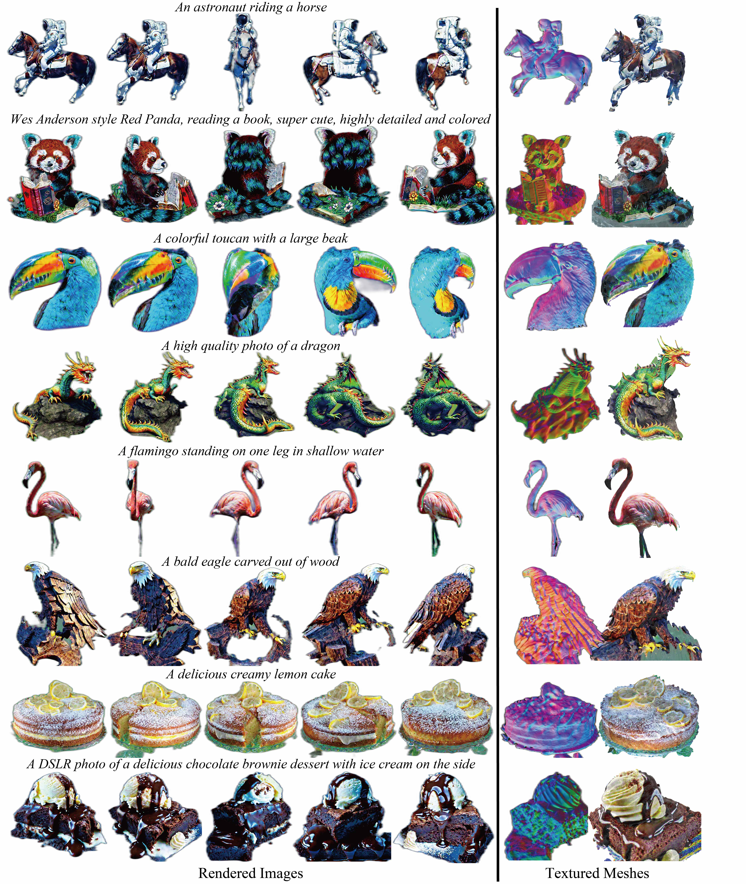
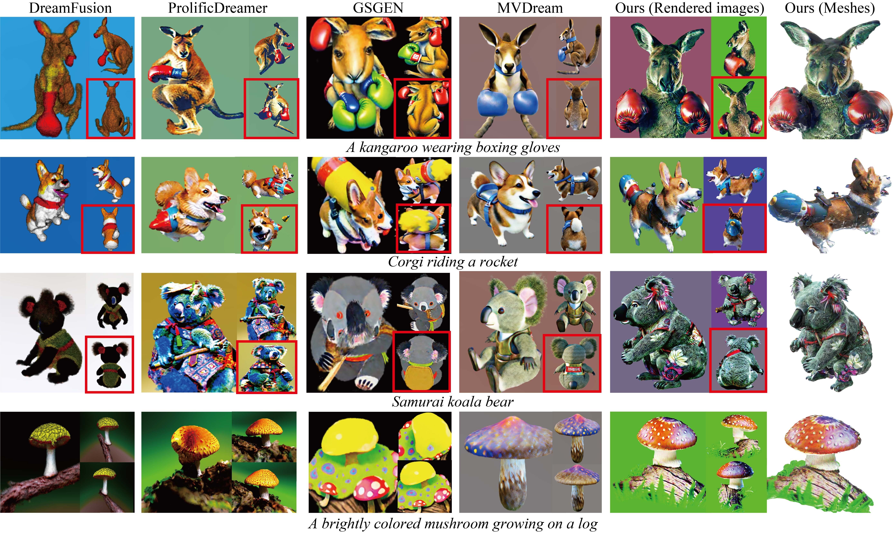
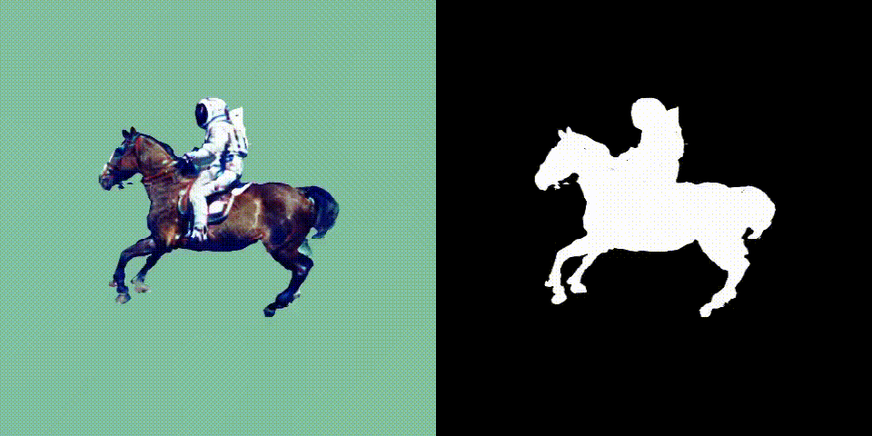
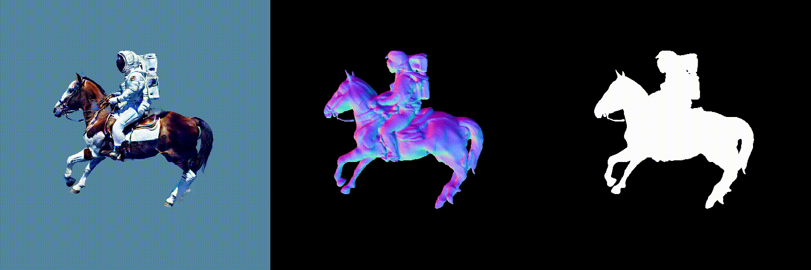

<div align='center'>

<h2><a href="https://mabaorui.github.io/GeoDream_page/">GeoDream: Disentangling 2D and Geometric Priors for High-Fidelity and Consistent 3D Generation</a></h2>

[Baorui Ma](https://mabaorui.github.io)<sup>1*</sup>, [Haoge Deng](https://github.com/Bitterdhg)<sup>2,1*</sup>, [Junsheng Zhou](https://junshengzhou.github.io/)<sup>3,1</sup>, [Yu-Shen Liu](https://yushen-liu.github.io/)<sup>3</sup>, [Tiejun Huang](https://scholar.google.com/citations?user=knvEK4AAAAAJ&hl=en)<sup>1,4</sup>, [Xinlong Wang](https://www.xloong.wang/)<sup>1</sup>
 
<sup>1</sup>[BAAI](https://www.baai.ac.cn/english.html), <sup>2</sup>[BUPT](https://www.bupt.edu.cn/#/), <sup>3</sup>[THU](https://www.tsinghua.edu.cn/en/), <sup>4</sup>[PKU](https://english.pku.edu.cn/) <br>
<sup>*</sup> Equal Contribution
 
## [Paper](https://arxiv.org/abs/2311.17971) | [Project page](https://mabaorui.github.io/GeoDream_page/)


</div>
This is GeoDream extension of <a href="https://github.com/threestudio-project/threestudio"> threestudio</a>. The original implementation can be found <a href="https://github.com/baaivision/GeoDream/tree/master">at the master branch</a>. To use it, please install threestudio first and then install this extension in threestudio custom directory.

<!-- **NOTE**: The backbone (4D hash grid) and some hyperparameters of this implementation differ from those of the original one, so the results might be different.  -->

## Installation

```sh
cd custom
git clone -b threestudio https://github.com/baaivision/GeoDream.git
mv GeoDream threestudio-geodream

```


We present GeoDream, a 3D generation method that incorporates explicit generalized 3D priors with 2D diffusion priors to enhance the capability of obtaining unambiguous 3D consistent geometric structures without sacrificing diversity or fidelity. 
Our numerical and visual comparisons demonstrate that GeoDream generates more 3D consistent textured meshes with high-resolution realistic renderings (i.e., 1024 &times 1024) and adheres more closely to semantic coherence.
To comprehensively evaluate semantic coherence, to our knowledge, we are the first to propose <b style="color: rgb(255, 0, 0);">Uni3D-score metric</b>, lifting the measurement from 2D to 3D. You can find detailed usage instructions for training GeoDream and evaluation code of 3D metric <a href="https://github.com/baaivision/Uni3D">Uni3D</a>-score below.




GeoDream alleviates the Janus problems by incorporating explicit 3D priors with 2D diffusion priors. GeoDream generates consistent <b style="color: rgb(255, 0, 0);">**multi-view rendered images**</b> and rich details <b style="color: rgb(255, 0, 0);">**textured meshes**</b>.


Qualitative comparison with baselines. Back views are highlighted with <b style="color: rgb(255, 0, 0);">**red rectangles**</b> for distinct observation of multiple faces.

## News
**[1/5/2024]**
Add support for GeoDream extension of [ThreeStudio](https://github.com/threestudio-project/threestudio).

**[12/20/2023]**
Add support for [Stable-Zero123](https://stability.ai/news/stable-zero123-3d-generation). Follow the instructions [here](#predict-source-views-driven-by-a-given-reference-view-with-a-prompt) to give it a try.

**[12/2/2023]**
Code released.

## Installation
```sh
git clone https://github.com/baaivision/GeoDream.git
cd GeoDream
```
Due to environmental conflicts between the pre-trained multi-view diffusion for predicting source views and the code for constructing cost volume, we currently have to use two separate virtual environments. This is inconvenient for researchers, and we are working hard to resolve the conflicts as part of our future update plans.
### Install for predicting source views
See [mv-diffusion/README.md](mv-diffusion/README.md) for additional information for install.
<!-- ```sh
conda env create -f mv-diffusion/mv-environment.yaml -n mvDiffusion
``` -->
### Installation for constructing cost volume

See [installation.md](docs/installation.md) for additional information, including installation via Docker.

The following steps have been tested on Ubuntu20.04.

- You must have an NVIDIA graphics card with at least 24GB VRAM and have [CUDA](https://developer.nvidia.com/cuda-downloads) installed.
- Install `Python >= 3.8`.
- (Optional, Recommended) Create a virtual environment:

```sh
python3 -m virtualenv venv
. venv/bin/activate

# Newer pip versions, e.g. pip-23.x, can be much faster than old versions, e.g. pip-20.x.
# For instance, it caches the wheels of git packages to avoid unnecessarily rebuilding them later.
python3 -m pip install --upgrade pip
```

- Install `PyTorch >= 1.12`. We have tested on `torch1.12.1+cu113` and `torch2.0.0+cu118`, but other versions should also work fine.

```sh
# torch1.12.1+cu113
pip install torch==1.12.1+cu113 torchvision==0.13.1+cu113 --extra-index-url https://download.pytorch.org/whl/cu113
# or torch2.0.0+cu118
pip install torch torchvision --index-url https://download.pytorch.org/whl/cu118
```

- (Optional, Recommended) Install ninja to speed up the compilation of CUDA extensions:

```sh
pip install ninja
```

- Install dependencies:

```sh
pip install -r requirements.txt
pip install inplace_abn
FORCE_CUDA=1 pip install --no-cache-dir git+https://github.com/mit-han-lab/torchsparse.git@v1.4.0
```

<!-- ### Download One-2-3-45 and Zero123 pre-trained weight
```bash
python mv-diffusion/One-2-3-45/download_ckpt.py
``` -->

**If you are experiencing unstable connections with Hugging Face, we suggest you either (1) setting environment variable `TRANSFORMERS_OFFLINE=1 DIFFUSERS_OFFLINE=1 HF_HUB_OFFLINE=1` before your running command after all needed files have been fetched on the first run, to prevent from connecting to Hugging Face each time you run, or (2) downloading the guidance model you used to a local folder following [here](https://huggingface.co/docs/huggingface_hub/v0.14.1/guides/download#download-an-entire-repository) and [here](https://huggingface.co/docs/huggingface_hub/v0.14.1/guides/download#download-files-to-local-folder), and set `pretrained_model_name_or_path` and `pretrained_model_name_or_path_lora` in `configs/geodream-neus.yaml`, `configs/geodream-dmtet-geometry.yaml`, and `configs/geodream-dmtet-texture.yaml` to the local path.**

# Quickstart

These steps required for 3D generation are as follows.

1. Predict source views (Choose one of the following two.)
      - [Driven by a given prompt](#predict-source-views-driven-by-a-given-prompt)
      - [Driven by a given reference view with a prompt](#predict-source-views-driven-by-a-given-reference-view-with-a-prompt)
2. [Construct cost volume](#construct-cost-volume)
3. [GeoDream Training](#geodream-training)


## Predict source views 
Choose one of the two.
### Predict source views driven by a given reference view with a prompt
```bash
conda activate geodream_mv
cd ./mv-diffusion
sh run-volume-by-zero123.sh "An astronaut riding a horse" "ref_imges/demo.png"
# Defaulting to use Zero123. If the generated results are not satisfactory, consider using Stable Zero123.
sh run-volume-by-sd-zero123.sh "An astronaut riding a horse" "ref_imges/demo.png"
conda deactivate
cd ..
```
### Predict source views driven by a given prompt
```bash
conda activate geodream_mv
cd ./mv-diffusion
sh step1-run-mv.sh "An astronaut riding a horse"
conda deactivate
cd ..
```

## Construct cost volume
```bash
. venv/bin/activate
cd ./mv-diffusion
sh step2-run-volume.sh "An astronaut riding a horse"
```

## GeoDream Training

**Rendered images obtained from Stage1**



**Rendered images obtained from Stage2+3**



Note: we compress these motion pictures for faster previewing.

```sh
# --------- Stage 1 (NeuS) --------- #
# object generation with 512x512 NeuS rendering, ~25GB VRAM
python launch.py --config custom/threestudio-geodream/configs/geodream-neus.yaml --train --gpu 0 system.prompt_processor.prompt="an astronaut riding a horse" system.geometry.init_volume_path="mv-diffusion/volume/An_astronaut_riding_a_horse/con_volume_lod_150.pth"
# if you don't have enough VRAM, try training with 64x64 NeuS rendering, ~15GB VRAM
python launch.py --config custom/threestudio-geodream/configs/geodream-neus.yaml --train --gpu 0 system.prompt_processor.prompt="an astronaut riding a horse" system.geometry.init_volume_path="data/con_volume_lod_150.pth" data.width=64 data.height=64
# using the same model for pretrained and LoRA enables 64x64 training with <10GB VRAM
# but the quality is worse due to the use of an epsilon prediction model for LoRA training
python launch.py --config custom/threestudio-geodream/configs/geodream-neus.yaml --train --gpu 0 system.prompt_processor.prompt="an astronaut riding a horse" system.geometry.init_volume_path="data/con_volume_lod_150.pth" data.width=64 data.height=64 system.guidance.pretrained_model_name_or_path_lora="stabilityai/stable-diffusion-2-1-base"

# --------- Stage 2 (DMTet Geometry Refinement) --------- #
# refine geometry
python launch.py --config custom/threestudio-geodream/configs/geodream-dmtet-geometry.yaml --train system.geometry_convert_from=path/to/stage1/trial/dir/ckpts/last.ckpt --gpu 0 system.prompt_processor.prompt="an astronaut riding a horse" system.renderer.context_type=cuda system.geometry_convert_override.isosurface_threshold=0.0

# --------- Stage 3 (DMTet Texturing) --------- #
# texturing with 1024x1024 rasterization, Stable Diffusion VSD guidance, ~20GB VRAM
python launch.py --config custom/threestudio-geodream/configs/geodream-dmtet-texture.yaml system.geometry.isosurface_resolution=256 --train data.batch_size=2 system.renderer.context_type=cuda --gpu 0 system.geometry_convert_from=path/to/stage2/trial/dir/ckpts/last.ckpt system.prompt_processor.prompt="an astronaut riding a horse"
# if you don't have enough VRAM, try training with batch_size=1, ~10GB VRAM
python launch.py --config custom/threestudio-geodream/configs/geodream-dmtet-texture.yaml system.geometry.isosurface_resolution=256 --train data.batch_size=1 system.renderer.context_type=cuda --gpu 0 system.geometry_convert_from=path/to/stage2/trial/dir/ckpts/last.ckpt system.prompt_processor.prompt="an astronaut riding a horse"
```

We also provide corresponding scripts for researchers to reference: `neus-train.sh` corresponds to stage 1,  `mesh-finetuning-geo.sh` and `mesh-finetuning-texture.sh` corresponds to stage 2 and 3.

### Resume from checkpoints

If you want to resume from a checkpoint, do:

```sh
# resume training from the last checkpoint, you may replace last.ckpt with any other checkpoints
python launch.py --config path/to/trial/dir/configs/parsed.yaml --train --gpu 0 resume=path/to/trial/dir/ckpts/last.ckpt
# if the training has completed, you can still continue training for a longer time by setting trainer.max_steps
python launch.py --config path/to/trial/dir/configs/parsed.yaml --train --gpu 0 resume=path/to/trial/dir/ckpts/last.ckpt trainer.max_steps=20000
# you can also perform testing using resumed checkpoints
python launch.py --config path/to/trial/dir/configs/parsed.yaml --test --gpu 0 resume=path/to/trial/dir/ckpts/last.ckpt
# note that the above commands use parsed configuration files from previous trials
# which will continue using the same trial directory
# if you want to save to a new trial directory, replace parsed.yaml with raw.yaml in the command

# only load weights from saved checkpoint but don't resume training (i.e. don't load optimizer state):
python launch.py --config path/to/trial/dir/configs/parsed.yaml --train --gpu 0 system.weights=path/to/trial/dir/ckpts/last.ckpt
```

### Export Rendered Videos

```sh
python launch.py --config path/to/trial/dir/configs/parsed.yaml --test --gpu 0 resume=path/to/trial/dir/ckpts/last.ckpt
```

### Export Texture Meshes

**Textured meshes obtained from Stage2+3**

<!-- 
 -->
<p align="center">
  
   
</p>

To export the scene to texture meshes, use the `--export` option. We currently support exporting to obj+mtl, or obj with vertex colors.

```sh
# this uses default mesh-exporter configurations which exports obj+mtl
python launch.py --config "path/to/stage3/trial/dir/configs/parsed.yaml"  --export --gpu 0 resume="path/to/stage3/trial/dir/ckpts/last.ckpt"  system.exporter_type=mesh-exporter system.exporter.context_type=cuda
```


## Schedule

We are committed to open-sourcing GeoDream related materials, including:

- [x] Text-to-3D inference code
- [x] Export rendered videos
- [x] Textured meshes extraction
- [ ] Text-to-3D with a single-view reference image
- [ ] Evaluation code of [Uni3D](https://github.com/baaivision/Uni3D/tree/main) Score, lifting the semantic coherence measurement from 2D to 3D.
- [ ] Release the checkpoints of our generated results to help researchers conduct fair comparisons.
- [ ] Test prompts

## Acknowledgement

GeoDream is built using the awesome open-source projects: [Uni3D](https://github.com/baaivision/Uni3D), [ThreeStudio](https://github.com/threestudio-project/threestudio), [MVDream](https://github.com/bytedance/MVDream), [One2345](https://github.com/One-2-3-45/One-2-3-45),[Zero123](https://github.com/cvlab-columbia/zero123), [Zero123++](https://github.com/SUDO-AI-3D/zero123plus).

Thanks to the maintainers of these projects for their contribution to the community!

## Citation

If you find GeoDream helpful, please consider citing:

```
@inproceedings{Ma2023GeoDream,
    title = {GeoDream: Disentangling 2D and Geometric Priors for High-Fidelity and Consistent 3D Generation},
    author = {Baorui Ma and Haoge Deng and Junsheng Zhou and Yu-Shen Liu and Tiejun Huang and Xinlong Wang},
    journal={arXiv preprint arXiv:2311.17971},
    year={2023}
}
```
